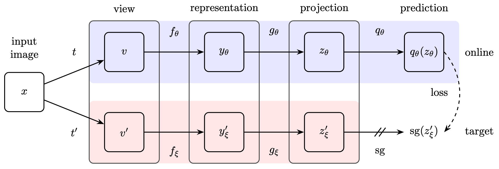

# BYOL-PyTorch

PyTorch implementation of [Bootstrap Your Own Latent: A New Approach to Self-Supervised Learning](https://arxiv.org/abs/2006.07733).



This repository contains training pipeline for BYOL, and I reimplement it with PyTorch. It support CIFAR-10, CIFAR-100, STL-10, TinyImageNet-200 and ImageNet. It also provides the linear probing code, which I borrow from [sthalles](https://github.com/sthalles/PyTorch-BYOL). Thanks for their excellent project :)

## Run on your machine

I recommand you to put your dataset into `./data/xxx`:

```
./data/STL-10
./data/CIFAR-10
...
```

You need first create environment and then run `train.sh`:

```bash
conda env create --name byol -r requirements.txt
conda activate byol
sh train.sh
```

If all goes well, the final result will be approximately `73.8%`.

Feel free to contact me if you have any problem:)